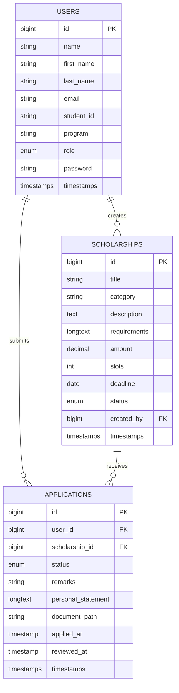

# SCHOLARIX ERD

## Relationship summary

- One user can submit many applications.
- One scholarship can receive many applications.
- One admin user can create many scholarships.
- A user can only apply once per scholarship because of the unique constraint on `user_id` and `scholarship_id`.
